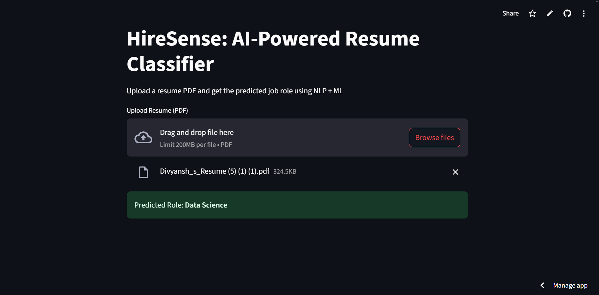

# 🤖 HireSense – AI-Powered Resume Classifier

[](https://streamlit.io)
[](https://www.python.org/)
[](LICENSE)

> An intelligent resume classification system that predicts the best-fit job role from a given resume PDF using NLP + Machine Learning.

---

## Live Demo

**Try it here**:  
🔗 [https://hiresense-peqy6gcp2srkufdpmh7mbp.streamlit.app](https://hiresense-peqy6gcp2srkufdpmh7mbp.streamlit.app)

---

## Preview


---

## Features

- Upload a resume PDF  
- Extracts clean text using PyMuPDF  
- Predicts job role using Logistic Regression  
- Supports job categories like:
  - Data Scientist
  - Backend Developer
  - Frontend Developer
  - Full Stack Engineer
  - DevOps Engineer  
- Clean interactive UI powered by Streamlit

---

## 🛠 Tech Stack

| Area         | Tools & Libraries                                           |
|--------------|-------------------------------------------------------------|
| Language     | Python                                                      |
| ML/NLP       | `scikit-learn`, `pandas`, `joblib`, `TfidfVectorizer`       |
| PDF Parsing  | `PyMuPDF` (`fitz`)                                          |
| Web UI       | `Streamlit`                                                 |

---

## 📁 Folder Structure

```bash
HireSense/
├── app.py                # Streamlit App
├── requirements.txt      # Dependencies
├── model/                # Trained ML model + vectorizer
├── preprocess/           # Data processing scripts
├── data/                 # labels.csv, resume texts
├── .gitignore
└── README.md

---

## How to Run Locally

### 1. Install dependencies

```bash
pip install -r requirements.txt
````

### 2. Run the Streamlit app

```bash
streamlit run app.py
```

---

##  How to Train Your Own Model

If you want to retrain the model using the Kaggle dataset:

```bash
python preprocess/convert_kaggle_dataset.py
python model/train_model.py
```

* The first script converts the CSV into labeled text files.
* The second script trains a logistic regression model and saves it as `.pkl`.

````
